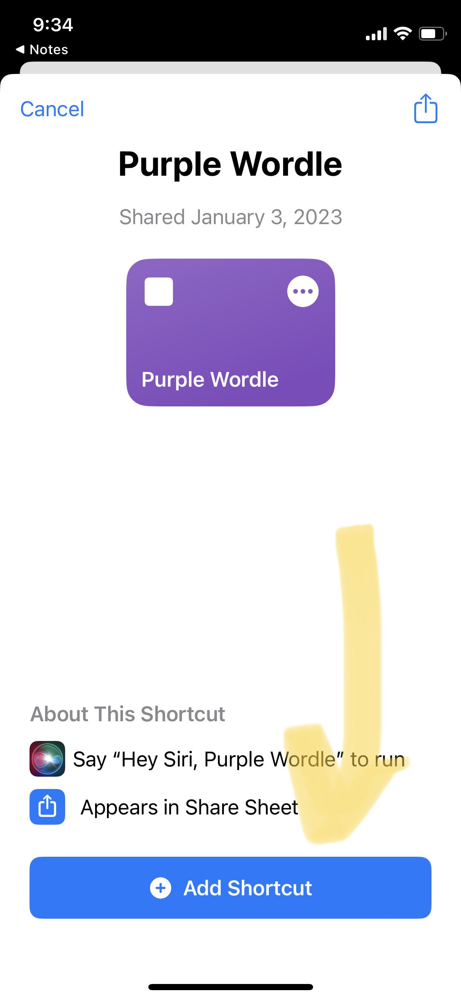
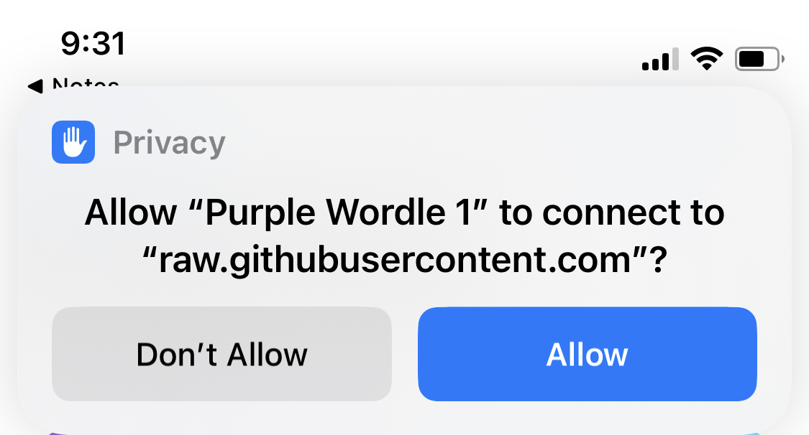

# Purple Wordle

## Installation

From your iPhone, [download Purple Wordle](https://www.icloud.com/shortcuts/f79008edb02a4cbd94353950b50f1696).

Then tap "Add Shortcut":

You may have to allow Purple Wordle to connect to `raw.githubusercontent.com`:

## Using Purple Wordle

When you finish your Wordle tap `Share` as you normally do, but before tapping on a conversation as you normally would, select Purple Wordle:

